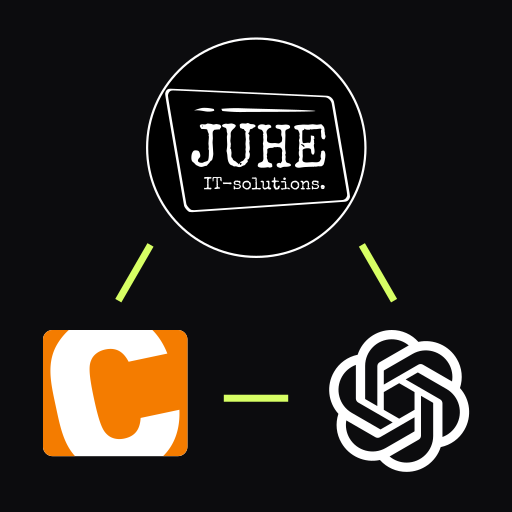

# Contao OpenAI Assistant

<p align="center">
  
</p>

[](LICENSE)
[](https://contao.org)
[](https://php.net)
[](https://packagist.org/packages/juhe-it-solutions/contao-openai-assistant)

OpenAI Responses API integration for Contao 5.3+. The extension adds a backend dashboard for OpenAI configuration, prompt setup and knowledge-base files, plus a configurable frontend AI chatbot module.

It uses OpenAI's Responses API and Conversations API at runtime. Knowledge-base files are uploaded to OpenAI vector stores and attached through File Search.

> **Upgrading from 1.x?** Version 2.0 is a breaking change: the extension no longer calls the OpenAI Assistants API (`/v1/assistants`, `/v1/threads`). Any OpenAI Assistants created by older versions are cleaned up from the OpenAI platform by a one-shot migration on upgrade. See the [CHANGELOG](https://github.com/juhe-it-solutions/contao-openai-assistant/blob/main/CHANGELOG.md) and [Upgrading from 1.x](https://github.com/juhe-it-solutions/contao-openai-assistant/blob/main/docs/development/troubleshooting.md#upgrading-from-1x).

## Requirements

- Contao 5.3 or newer
- PHP 8.2 or newer
- OpenAI API key with access to Responses, Conversations, Files and Vector Stores

## Installation

Install with Contao Manager or Composer:

```bash
composer require juhe-it-solutions/contao-openai-assistant
```

Then run the Contao database migration. Detailed setup is documented in [`docs/installation.md`](https://github.com/juhe-it-solutions/contao-openai-assistant/blob/main/docs/installation.md).

## Automatic Vector-Store Sync (Premium Add-On)

> **Keep your chatbot knowledge base up to date automatically.**
>
> The premium add-on can crawl selected Contao pages and update the OpenAI vector store from your website content. It supports manual or scheduled runs and requires a valid premium license.
>
> Learn more in the [premium add-on help pages](https://licenses.juhe-it-solutions.at/en/openai-assistant/help).

## Documentation

- [`docs/README.md`](https://github.com/juhe-it-solutions/contao-openai-assistant/blob/main/docs/README.md) - documentation index
- [`docs/installation.md`](https://github.com/juhe-it-solutions/contao-openai-assistant/blob/main/docs/installation.md) - installation and first setup
- [`docs/configuration/openai-setup.md`](https://github.com/juhe-it-solutions/contao-openai-assistant/blob/main/docs/configuration/openai-setup.md) - OpenAI configuration
- [`docs/configuration/prompts.md`](https://github.com/juhe-it-solutions/contao-openai-assistant/blob/main/docs/configuration/prompts.md) - prompt configuration
- [`docs/development/troubleshooting.md`](https://github.com/juhe-it-solutions/contao-openai-assistant/blob/main/docs/development/troubleshooting.md) - upgrade notes and common issues

## License And Security

This extension is dual-licensed:

- **Core extension** (backend dashboard, prompts, knowledge-base files, frontend chatbot): LGPL-3.0-or-later, see [`LICENSE`](LICENSE).
- **Premium add-on** (automatic vector-store sync and license validation; the files listed in [`LICENSE-PREMIUM`](LICENSE-PREMIUM)): proprietary. The files ship with the package, but using the premium features requires a valid [premium subscription](https://licenses.juhe-it-solutions.at).

Versions tagged before the introduction of `LICENSE-PREMIUM` remain entirely under LGPL-3.0-or-later.

Please report security issues privately to office@juhe-it-solutions.at.
