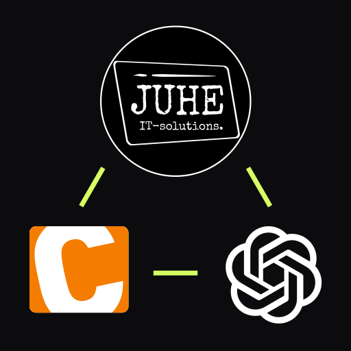

# Contao OpenAI Assistant

<p align="center">
  
</p>

[](LICENSE)
[](https://contao.org)
[](https://php.net)
[](https://packagist.org/packages/juhe-it-solutions/contao-openai-assistant)

OpenAI Responses API integration for Contao 6. The extension adds a backend dashboard for OpenAI configuration, prompt setup and knowledge-base files, plus a configurable frontend AI chatbot module.

It uses OpenAI's Responses API and Conversations API at runtime. Knowledge-base files are uploaded to OpenAI vector stores and attached through File Search.

> **This is the Contao 6 line (3.x).** It requires Contao 6 and PHP 8.4 and will not install on Contao 5. If you are on **Contao 5.3 or 5.7**, use the **2.x** line instead - it is maintained in parallel and carries the same features. See [Upgrading to 3.0.0](docs/upgrading-to-3.0.0.md) for moving an existing installation across.

> **Upgrading from 1.x?** Version 2.0 was a breaking change: the extension no longer calls the OpenAI Assistants API (`/v1/assistants`, `/v1/threads`). Any OpenAI Assistants created by older versions are cleaned up from the OpenAI platform by a one-shot migration on upgrade. Move to the 2.x line first, then to 3.x. See the [CHANGELOG](CHANGELOG.md) and [Upgrading from 1.x](docs/development/troubleshooting.md#upgrading-from-1x).

## Requirements

- Contao 6.0 or newer
- PHP 8.4 or newer
- OpenAI API key with access to Responses, Conversations, Files and Vector Stores

For Contao 5.3 and 5.7, use the 2.x line.

## Installation

Install with Contao Manager or Composer:

```bash
composer require juhe-it-solutions/contao-openai-assistant:^3.0
```

Without the version constraint, Composer resolves the newest release your Contao version allows, which on a Contao 5 installation is the 2.x line.

Then run the Contao database migration. Detailed setup is documented in [`docs/installation.md`](docs/installation.md).

## Automatic Vector-Store Sync (Premium Add-On)

> **Keep your chatbot knowledge base up to date automatically.**
>
> The premium add-on can crawl selected Contao pages and update the OpenAI vector store from your website content. It supports manual or scheduled runs and requires a valid premium license.
>
> Learn more in the [premium add-on help pages](https://licenses.juhe-it-solutions.at/en/openai-assistant/help).

## Documentation

- [`docs/README.md`](docs/README.md) - documentation index
- [`docs/installation.md`](docs/installation.md) - installation and first setup
- [`docs/configuration/openai-setup.md`](docs/configuration/openai-setup.md) - OpenAI configuration
- [`docs/configuration/prompts.md`](docs/configuration/prompts.md) - prompt configuration
- [`docs/development/troubleshooting.md`](docs/development/troubleshooting.md) - upgrade notes and common issues

## License And Security

This extension is dual-licensed:

- **Core extension** (backend dashboard, prompts, knowledge-base files, frontend chatbot): LGPL-3.0-or-later, see [`LICENSE`](LICENSE).
- **Premium add-on** (automatic vector-store sync and license validation; the files listed in [`LICENSE-PREMIUM`](LICENSE-PREMIUM)): proprietary. The files ship with the package, but using the premium features requires a valid [premium subscription](https://licenses.juhe-it-solutions.at).

Versions tagged before the introduction of `LICENSE-PREMIUM` remain entirely under LGPL-3.0-or-later.

Please report security issues privately to office@juhe-it-solutions.at.
